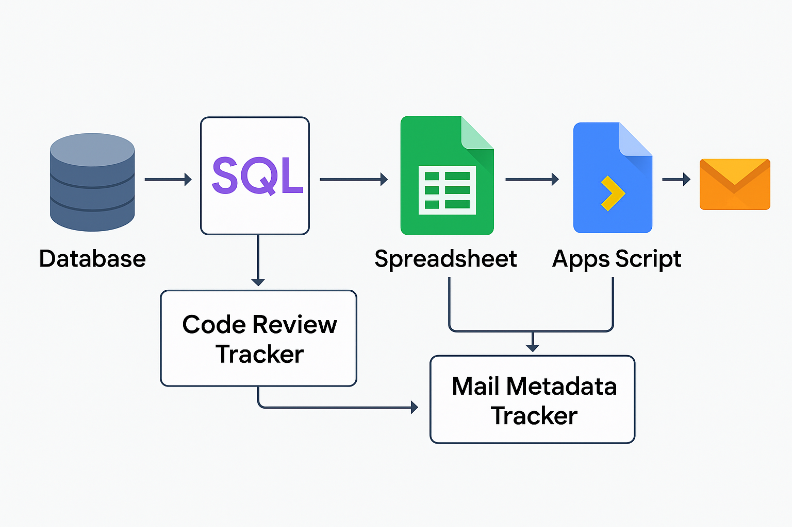

# Code-Review-Tracker
Automates code review tracking using SQL + Apps Script. Fetches review data from a database, calculates delays based on code size and priority, and exports to a spreadsheet. Sends reminder emails and logs actions—streamlining review cycles and boosting accountability.


> ⚠️ **Disclaimer**: This is a personal project inspired by process patterns I’ve encountered in collaborative engineering environments.  
> It does **not** use any proprietary company code, data, or internal systems.  
> All logic, terminology, and data structures have been fully generalized for educational and portfolio purposes only.

---

A lightweight workflow to automate code review tracking using SQL and Google Apps Script. It fetches review data from a central database, calculates delays based on code size and project priority, exports the results to a spreadsheet, and sends reminder emails to reviewers — while logging all actions.

---

## 📌 What It Does

- 🧠 Fetches pending code reviews from a structured database  
- 📊 Categorizes each code change by size and priority  
- ⏳ Calculates ideal vs. actual review delays  
- 📤 Exports results to a spreadsheet  
- 📬 Sends reminder and escalation emails via Apps Script  
- 📝 Logs all actions in a "Mail Tracker" sheet  

---

## 🛠️ Tech Stack

- **SQL** (compatible with BigQuery, DuckDB, Snowflake, etc.)  
- **Google Sheets** (for exporting and tracking)  
- **Google Apps Script** (for email automation and logging)  

---

## 📊 Review Logic

| Code Size (Total Lines) | Size Category |
|--------------------------|---------------|
| 1–10                     | XS            |
| 11–50                    | S             |
| 51–300                   | M             |
| 301–1000                 | L             |
| 1001+                    | XL            |

| Priority     | XS/S   | M       | L/XL   |
|--------------|--------|---------|--------|
| High         | 1 day  | 2 days  | 3 days |
| Medium       | 2 days | 3 days  | 4 days |
| Low          | 3 days | 4 days  | 5 days |
| Very Low     | 4 days | 5 days  | 6 days |

---

## 🧩 How It Works

1. **SQL Script**: Fetches and processes changelist data, calculates pending days and review expectations  
2. **Spreadsheet Export**: Results are written to a spreadsheet (manually or via cloud export)  
3. **Apps Script**: Linked script reads the sheet, sends reminders, and logs who was notified and when  

---

## 🗂️ System Architecture

The diagram below illustrates the full automation flow for the Code Review Tracker, from SQL extraction to reminder emails and review accountability tracking.


---
## 📁 Repo Structure

```
/code-review-tracker/
│
├── sql/
│   └── code_review_tracker.sql          # SQL logic for tracking reviews
│
├── scripts/
│   └── sendReminders.gs                 # Apps Script for emails & tracking
│
├── assets/
│   └── data_flow_diagram.png            # Visual of system flow (to be added)
│
├── data/
│   └── sample_review_data.xlsx          # Sample data for testing
│
├── README.md
└── LICENSE
```

---

## 🚀 How to Use

1. Export SQL results into a Google Sheet (or use the sample data)  
2. Paste the provided Apps Script into the Sheet's script editor  
3. Set up time-based triggers for automation  
4. Monitor review status, email alerts, and logs in the tracker sheet  

---

## 📬 Contributions

Suggestions and improvements are welcome!  
You can enhance the project by adding:  
- Slack or Teams notifications  
- Visual dashboards  
- GitHub/GitLab webhook support  

---

## 📄 License

[MIT License](./LICENSE) — free to use, modify, and share with credit.

